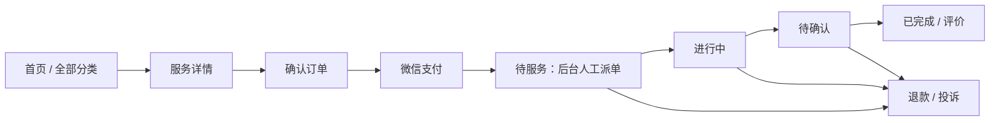

# 同类游戏服务小程序 PRD（参考原型版）

| 项目 | 内容 |
|---|---|
| 文档版本 | v2.0 |
| 文档状态 | 待云东评审；v1.0 不再作为实施依据 |
| 编制日期 | 2026-07-26 |
| 参考原型 | 微信小程序“云玩电竞-陪玩开黑” |
| 观察方式 | 已在云东电脑上逐页查看实际小程序 |
| 目标产品 | 与参考原型结构、体验和视觉气质相近的自营游戏服务小程序 |
| 商业模式 | 单商户自营、后台人工派单 |
| 首版终端 | 微信小程序顾客端 + Web 运营后台 |
| 推荐底座 | ShopXO + ShopXO UniApp 二次开发 |

---

## 0. 参考小程序观察结论

本 PRD 不是根据单张截图推测，而是基于实际打开并查看以下页面后重写。

| 已观察页面 | 参考小程序真实结构 | 本产品对应设计 |
|---|---|---|
| 首页 | 顶部大横幅、最新服务、更多入口、推荐频道、横向专区标签、纵向服务卡片、悬浮微信客服 | 保留相同信息密度和浏览顺序，替换为自有品牌和授权素材 |
| 全部分类 | 顶部搜索、左侧纵向专区、右侧服务列表、选中高亮、加载更多 | 保留左右分栏布局，左侧首批配置六个游戏专区及运营专区 |
| 服务详情 | 媒体区、标题、原价/现价、接单项目、服务团队说明、可接大区、服务详情、下单须知、三维评分、累计接单、用户评价 | 按同样顺序组织，评价必须来自真实已完成订单 |
| 下单页 | 商品摘要、服务技能、购买数量、优惠券、单价、手机端/电脑端、文字 ID、成年确认、备注、实付金额、立即支付 | 保留主要表单结构，增加按游戏配置的区服和预约时间；不收集明文密码 |
| 消息 | 系统通知、未读角标、空状态、悬浮客服 | 首版仅做系统消息，不自建顾客与服务人员私聊 |
| 我的 | 头像昵称与用户 ID、待付款/待服务/进行中/已完成、订单、余额、优惠券、投诉、邀请好友、设置 | P0 完成订单、优惠券、投诉和设置；余额与邀请好友设为 P1 开关功能 |
| 我的订单 | 全部、待付款、待服务、进行中、已完成五个标签，支持下拉刷新和空状态 | 完整保留顾客可见的五标签结构 |
| 设置中心 | 账号设置、消息通知、意见反馈、用户协议、隐私政策、关于我们、退出登录 | 微信登录模式下将“修改密码”改为“账号与安全” |

### 0.1 有意不照抄的部分

- 不复制参考小程序的名称、Logo、横幅、游戏图片、人物素材和商品文案；
- 不复制无法客观验证或未通过审核的“必出、百分百、永久安全”等承诺；
- 不把顾客账号密码做成订单字段；
- 不允许后台伪造销量、评价或评分；
- 不照搬“修改密码”，因为首版采用微信登录；
- “我的余额”和“邀请好友”保留产品位置，但在资质、财务和运营规则确认前默认关闭。

---

## 1. Problem Statement / 问题陈述

目标顾客希望在微信中快速找到适合某款游戏的陪玩、护航或代打服务，直观看懂服务内容、价格、可接平台和交付标准，然后完成微信支付并持续查看服务进度。

经营方需要一个与成熟参考产品相近、能够快速运营的系统，而不是一份抽象的通用商城需求。产品必须解决：

1. 如何用首页横幅、最新服务和专区推荐形成快速转化；
2. 如何让顾客在大量游戏与服务套餐中快速筛选；
3. 如何在详情页建立服务能力、真实接单量和用户评价的信任；
4. 如何在下单页收集端游/手游、区服、游戏 ID、数量等履约信息；
5. 如何在微信支付后由后台人工派单，并让顾客看到待服务、进行中和完成状态；
6. 如何通过消息、客服、投诉和售后承接异常订单；
7. 如何在“外观相似”的同时避免直接复制素材、虚假数据、账号凭证和不合规承诺。

---

## 2. Product Positioning / 产品定位

### 2.1 一句话定位

一个采用深色电竞视觉、按游戏专区组织服务套餐、支持微信支付和人工派单的自营游戏陪玩/护航小程序。

### 2.2 首批游戏专区

- 英雄联盟；
- 永劫无间；
- 三角洲行动；
- 王者荣耀；
- 绝地求生；
- 无畏契约。

后台须继续区分端游/手游、PC/移动端、具体产品版本和区服，不能只使用游戏名称描述履约范围。

### 2.3 首批服务类型

- 陪玩：按小时、局数或套餐计价；
- 护航：按小时、局数、指定任务或明确目标计价；
- 教学：按小时或课程套餐计价；
- 代打：按游戏独立开关，默认关闭，审核通过后才可上架。

### 2.4 产品原则

- 顾客先浏览，支付前再登录和补充必要信息；
- 一张订单只购买一个服务套餐；
- 平台是唯一销售方，统一承担派单、客服、退款和投诉；
- 服务人员由后台创建并人工安排，不对外开放抢单；
- 微信客服和订单页是官方沟通渠道；
- 订单状态、销量和评价均由真实业务产生。

---

## 3. Solution / 解决方案

产品以参考小程序的四标签结构为骨架：

1. **首页**负责品牌展示、最新服务和运营推荐；
2. **全部分类**负责搜索、专区切换和服务筛选；
3. **消息**负责系统通知和未读提醒；
4. **我的**负责订单、优惠券、投诉和设置。

顾客从首页或分类进入服务详情，查看服务团队说明、支持平台、交付标准、评分和评价；点击立即下单后选择数量、优惠券、游戏平台/区服，填写游戏 ID，完成成年确认并微信支付。支付成功后，运营人员在后台人工选择内部服务人员，依次更新待服务、进行中和已完成。顾客可从订单、消息和客服入口追踪进度并提出投诉或售后。

---

## 4. Scope and Priority / 范围与优先级

### 4.1 P0：首版必须上线

- 微信登录与自动注册平台用户；
- 首页横幅、最新服务、更多、推荐频道和专区标签；
- 全部分类页的搜索、左侧专区和右侧服务列表；
- 服务详情、评分、真实累计接单和真实用户评价；
- 订单确认、数量、优惠券、平台/区服、游戏 ID、成年确认和备注；
- 微信支付 APIv3；
- 待付款、待服务、进行中、已完成四类快捷入口；
- 全部/待付款/待服务/进行中/已完成订单列表；
- 系统消息、未读角标和空状态；
- 悬浮微信客服与详情页底部客服；
- 我的优惠券、我的投诉、意见反馈、协议、隐私、关于我们、退出登录；
- 运营后台的内容、套餐、订单、人工派单、人员、优惠券、评价审核和投诉处理；
- 支付、退款、操作和状态审计日志。

### 4.2 P1：首版稳定后开启

- 我的余额、充值与余额抵扣；
- 邀请好友与优惠券奖励；
- 微信订阅消息；
- 服务人员轻量任务工作台；
- 预约容量与排班；
- 更丰富的运营活动和数据看板。

### 4.3 不作为首版上线前提

- 外部服务人员注册和抢单；
- 顾客与服务人员的自建即时聊天；
- 多商户、平台抽佣、分账、提现；
- H5、App 和 PC 顾客端；
- 充值余额和现金邀请奖励。

---

## 5. Actors and Permissions / 角色与权限

### 5.1 顾客

浏览、搜索、下单、微信支付、查看订单、接收系统消息、使用优惠券、评价、投诉、联系客服和管理个人设置。

### 5.2 运营/派单员

维护首页与服务内容，查看已支付订单，线下确认服务人员后人工派单，更新服务进度并处理普通售后。

### 5.3 客服

按订单号查询顾客、支付、派单和履约摘要，记录沟通结果，处理投诉和退款建议。

### 5.4 财务

查看支付、退款和对账记录，处理差异，不修改商品和履约状态。

### 5.5 管理员

配置游戏专区、人员、角色权限、支付、协议、功能开关、审计和高风险退款。

### 5.6 内部服务人员

首版仅作为后台可分配资源，保存昵称、头像、擅长游戏、支持平台、可用状态、内部联系方式和备注；不是公开入驻商家。

---

## 6. Visual and Interaction Specification / 视觉与交互规范

### 6.1 整体气质

- 风格：深色电竞、霓虹科技、强对比；
- 页面背景：深靛蓝；
- 卡片背景：近黑蓝；
- 主强调色：高亮青蓝，用于标题、选中状态和重点信息；
- 价格强调色：橙色；
- 主要文字：白色；
- 次要文字：蓝灰色；
- 卡片大圆角、低描边、轻微发光，不使用复杂玻璃拟态影响可读性。

建议设计令牌：

| 用途 | 建议值 |
|---|---|
| 页面背景 | `#20256C` |
| 一级卡片 | `#080D3A` |
| 二级卡片 | `#11174D` |
| 选中背景 | `#4B5078` |
| 主强调色 | `#1EF2F5` |
| 价格色 | `#FF7A00` |
| 主文字 | `#FFFFFF` |
| 次文字 | `#AAB3D5` |
| 设计基准 | 750rpx |
| 页面左右边距 | 24rpx |
| 卡片圆角 | 20–28rpx |

以上颜色根据参考画面提炼，不要求逐像素复制。

### 6.2 共用组件

- 顶部标题栏；
- 全宽横幅轮播；
- 服务商品卡；
- 横向专区标签；
- 左侧分类菜单；
- 搜索框；
- 原价删除线 + 现价；
- 五星评分；
- 数量步进器；
- 订单状态标签；
- 空状态插画；
- 加载骨架、下拉刷新和加载更多；
- 右下角悬浮微信客服；
- 底部吸附操作栏。

### 6.3 底部导航

| Tab | 页面 | 未读表现 |
|---|---|---|
| 首页 | 首页 | 无 |
| 全部分类 | 分类页 | 无 |
| 消息 | 系统消息 | 红色数字角标 |
| 我的 | 个人中心 | 可显示待处理点，不显示金额 |

底部导航固定在安全区上方，当前项使用青蓝色高亮。

---

## 7. Page Specifications / 页面级需求

### 7.1 首页

#### 页面目标

在一屏内完成品牌建立、热门服务曝光和快速转化。

#### 页面结构

1. 顶部标题“首页”；
2. 横幅轮播；
3. “最新服务”标题与“更多 >”；
4. 最新服务卡片，默认展示 3 条；
5. “推荐”商品区域；
6. 横向可滚动专区标签；
7. 对应专区的服务商品列表；
8. 加载更多；
9. 右下角悬浮微信客服；
10. 底部导航。

#### 横幅规则

- 后台配置图片、排序、启停、开始/结束时间和跳转目标；
- 支持跳转服务详情、专区或活动页；
- 至少支持自动轮播、手动滑动和页码指示；
- 未配置时不展示空白横幅。

#### 最新服务

- 由后台人工勾选或按上架时间自动产生；
- 商品卡展示封面、标题、专区标签、简短团队说明、原价和现价；
- 点击整张卡进入详情；
- “更多”进入带“最新”筛选的服务列表。

#### 推荐专区

- 默认第一个标签为“推荐”；
- 后续标签可配置为六个游戏专区或运营专区；
- 切换标签不离开首页，并保留当前滚动位置；
- 商品列表分页加载，重复请求不得插入重复商品。

### 7.2 全部分类

#### 页面结构

1. 顶部标题“分类”；
2. 搜索入口；
3. 左侧固定宽度、可滚动专区列表；
4. 右侧当前专区商品列表；
5. 选中专区背景高亮；
6. 悬浮微信客服；
7. 底部导航。

#### 初始左侧专区

- 推荐/新人体验；
- 英雄联盟专区；
- 永劫无间专区；
- 三角洲行动专区；
- 王者荣耀专区；
- 绝地求生专区；
- 无畏契约专区；
- 陪玩专区；
- 护航专区；
- 教学专区；
- 热门活动。

后台可排序、改名、隐藏和配置图标。专区可以关联一个游戏、服务类型或运营商品集合。

#### 商品卡

- 左侧 1:1 封面；
- 右侧标题最多 3 行；
- 专区小图标和专区名称；
- 一行服务团队摘要；
- 原价灰色删除线；
- 现价橙色突出；
- 售罄或暂停接单时显示遮罩并禁止下单。

### 7.3 搜索

#### 页面结构

- 搜索输入框；
- 最近搜索；
- 热门关键词；
- 搜索结果；
- 无结果空状态。

#### 搜索范围

- 服务标题；
- 游戏/专区名称；
- 服务类型；
- 运营关键词。

结果按上架状态、关键词匹配度和后台权重排序。不得搜索到已下架商品。

### 7.4 服务详情

#### 页面结构顺序

1. 顶部返回与标题“服务详情”；
2. 图片/视频媒体区；
3. 服务标题；
4. 所属专区；
5. 原价和现价；
6. 接单项目；
7. 服务团队说明；
8. 可接平台/大区；
9. 可接项目；
10. 具体详情；
11. 下单须知；
12. 综合评分；
13. 技术水平、服务态度、响应速度三项评分；
14. 累计接单；
15. 用户评价列表；
16. 底部“联系客服 + 立即下单”吸附栏。

#### 服务详情字段

| 字段 | 说明 |
|---|---|
| 服务标题 | 明确游戏、服务、数量/时长或目标 |
| 所属专区 | 可点击回到对应专区 |
| 服务团队说明 | 服务人员筛选方式、服务风格、能力范围 |
| 可接平台 | 手机端、电脑端或指定设备 |
| 可接大区 | 具体区服或全区服 |
| 可接项目 | 陪玩、护航、教学、代打等 |
| 履约标准 | 小时数、局数、任务、目标和完成判定 |
| 下单须知 | 成年提示、防骗、退款、站内沟通和账号安全 |

#### 评分与评价

- 只有已完成订单的顾客可以评价；
- 一张订单最多一条评价，可追评一次；
- 评分维度为技术水平、服务态度、响应速度；
- 综合评分按真实评价计算并说明样本数；
- 累计接单仅统计真实有效订单；
- 后台只能审核违规内容，不能编辑星级、伪造评价或随意增加接单量；
- 评价默认匿名展示“微信用户”，顾客可选择展示昵称。

### 7.5 确认订单

#### 页面结构

1. 商品摘要：封面、标题、现价；
2. 服务技能/所属专区；
3. 购买数量步进器；
4. 优惠券选择；
5. 单价；
6. 游戏平台：手机端/电脑端或后台配置项；
7. 游戏区服；
8. 游戏文字 ID；
9. 服务时间：立即服务/预约时间；
10. 成年确认；
11. 备注说明；
12. 底部实付金额；
13. “立即支付”按钮。

#### 动态字段

不同套餐可配置：单选、多选、文本、数字、日期时间和只读说明。字段可设置必填、提示、格式校验、是否影响价格和顾客可见范围。

#### 订单规则

- 一张订单只含一个套餐；
- 购买数量用于小时数、局数或相同单位叠加；
- 服务端重新计算价格，前端金额不作为收款依据；
- 金额统一以整数分保存；
- 下单时保存商品、价格、参数、详情、须知和协议快照；
- 未勾选“本人已成年并知晓禁止未成年人下单”时不能支付；
- 未填写必填平台、区服或游戏 ID 时不能支付；
- 备注不允许填写账号密码、短信验证码、支付密码或身份证件；
- 需要临时登录的服务，支付后由客服按安全流程处理，系统不保存明文长期密码。

#### 优惠券

- 展示可用、不可用及不可用原因；
- 支持满减券和无门槛券；
- 首版一单最多使用一张；
- 券的游戏、专区、套餐、门槛和有效期由后台配置；
- 支付失败或订单关闭后按规则退回优惠券。

### 7.6 支付结果

- 支付成功：展示订单号、实付、当前“待服务”状态、查看订单、联系客服；
- 支付取消：保留待付款订单，提供重新支付或取消；
- 结果未知：显示“正在确认”，由服务端主动查单；
- 仅以后端验签通知或主动查单结果确认支付成功；
- 不在前端点击结果后直接修改付款状态。

### 7.7 消息

#### 消息类型

- 注册成功；
- 订单创建；
- 支付成功；
- 已安排服务；
- 服务开始；
- 服务完成待确认；
- 订单完成；
- 退款进度；
- 投诉处理结果；
- 优惠券即将过期；
- 系统公告。

#### 页面规则

- 列表展示图标、标题、摘要、时间、已读/未读；
- 底部导航显示未读数字角标；
- 点击消息跳转关联订单、投诉或活动；
- 支持全部已读；
- 无消息时展示与参考产品相似的深色空状态；
- 首版不提供顾客与服务人员私聊。

### 7.8 我的

#### 页面结构

1. 用户头像、昵称和平台用户 ID；
2. 四个订单快捷入口：待付款、待服务、进行中、已完成；
3. 常用功能卡片；
4. 我的订单；
5. 我的优惠券；
6. 我的投诉；
7. 设置中心；
8. P1：我的余额；
9. P1：邀请好友；
10. 悬浮微信客服；
11. 底部导航。

用户首次微信登录后自动建立平台用户 ID，并生成一条注册成功系统消息。

### 7.9 我的订单

#### 顾客可见标签

- 全部；
- 待付款；
- 待服务；
- 进行中；
- 已完成。

取消、退款和投诉状态在“全部”及订单详情中展示，不额外挤占顶部标签。

#### 订单卡片

- 订单编号；
- 当前状态；
- 商品封面与标题；
- 关键下单参数；
- 数量、实付和下单时间；
- 对应状态操作按钮。

#### 状态操作

| 状态 | 顾客操作 |
|---|---|
| 待付款 | 继续支付、取消订单、联系客服 |
| 待服务 | 查看派单进度、申请退款、联系客服 |
| 进行中 | 查看服务信息、联系客服、发起投诉 |
| 待确认 | 确认完成、提出异议、联系客服 |
| 已完成 | 评价、再次购买、投诉/售后 |

支持下拉刷新、分页加载和空状态。

### 7.10 我的优惠券

- 未使用、已使用、已过期三类；
- 展示券名、面额、门槛、适用范围、有效期和使用入口；
- 可从券进入适用服务列表；
- 禁止重复使用；
- 后台可批量发放、定向发放和作废未使用券。

### 7.11 我的投诉

- 投诉必须关联订单；
- 支持原因、文字说明和必要图片凭证；
- 状态：待处理、处理中、已解决、已关闭；
- 展示提交时间、客服回复和处理结果；
- 投诉处理中暂停订单自动完成；
- 凭证按最小必要原则保存并限制查看权限。

### 7.12 设置中心

- 账号与安全；
- 消息通知开关；
- 意见反馈；
- 用户协议；
- 隐私政策；
- 关于我们；
- 退出登录。

退出登录必须二次确认；退出后保留依法应保存的订单，不删除账户。

### 7.13 P1：我的余额

- 余额明细、充值、消费和退款；
- 支付时可选余额抵扣；
- 不支持自由提现；
- 上线前单独确认预付资金、退款和财务规则；
- 功能未启用时从个人中心隐藏，不展示空入口。

### 7.14 P1：邀请好友

- 使用微信分享卡片或海报；
- 记录邀请关系；
- 首版奖励只使用优惠券，不发现金佣金；
- 防止自邀、批量注册和刷券；
- 未启用时隐藏入口。

### 7.15 客服

- 首页、分类、消息、我的页面使用右下角悬浮微信客服；
- 服务详情使用底部固定“联系客服”；
- 确认订单、支付结果和订单详情均提供客服入口；
- 顾客进入客服前可一键复制订单号；
- 客服记录不得保存顾客密码、验证码或支付密钥；
- 不诱导顾客添加私人微信或进行站外支付。

---

## 8. Order and Fulfilment Model / 订单与履约模型

### 8.1 三类独立状态

支付状态、履约状态和售后状态分别保存，前台再映射为参考产品的四个主要订单分类。

### 8.2 支付状态

未支付、支付确认中、已支付、部分退款、已退款、已关闭。

### 8.3 履约状态

| 内部状态 | 前台归类 | 含义 |
|---|---|---|
| 待付款 | 待付款 | 订单已创建但未确认收款 |
| 待派单 | 待服务 | 已付款，等待运营安排人员 |
| 已派单待开始 | 待服务 | 服务人员已在线下确认，等待开始 |
| 服务中 | 进行中 | 服务正在履约 |
| 待顾客确认 | 进行中 | 服务方已提交完成，等待顾客确认 |
| 已完成 | 已完成 | 顾客确认或无异议超时完成 |
| 已取消 | 全部 | 未付款订单已取消或超时关闭 |

运营人员只有在线下取得服务人员确认后，才能将订单从“待派单”更新为“已派单待开始”。

### 8.4 售后状态

无售后、退款申请中、退款审核通过、退款中、已退款、退款驳回、投诉处理中、投诉已解决、售后已关闭。

### 8.5 初始业务规则

- 未支付订单 30 分钟自动关闭；
- 已支付且服务未开始，原则上支持全额原路退款；
- 商家无法在套餐承诺时间内派单，原则上支持全额退款；
- 服务开始后，根据已履约比例和证据人工处理；
- 待顾客确认默认 24 小时，无异议后自动完成；
- 投诉或售后处理中暂停自动完成；
- 所有状态变更记录操作人、来源、时间、原状态、新状态和原因。

---

## 9. Admin Console / 运营管理后台

### 9.1 工作台

- 今日订单、实收、退款；
- 待付款、待派单、进行中、待投诉处理；
- 超过派单时限和预约临近提醒；
- 热门游戏、热门套餐和转化数据。

### 9.2 首页装修

- 横幅管理；
- 最新服务选择；
- 推荐专区排序；
- 服务卡片展示开关；
- 活动起止时间与跳转。

### 9.3 专区与服务

- 游戏、专区、服务类型管理；
- 服务套餐增删改查、复制和上下架；
- 原价、现价、单位、预计响应时间；
- 媒体、团队说明、可接平台/区服、详情和须知；
- 动态下单字段；
- 代打独立总开关和逐游戏开关；
- 紧急停止接单。

### 9.4 人员与派单

- 内部服务人员档案；
- 擅长游戏、支持平台、可用状态；
- 待派单订单筛选；
- 指派、改派、开始、提交完成；
- 改派原因和历史记录；
- 内部备注与顾客可见进度分开。

### 9.5 订单、支付与退款

- 订单搜索、筛选、详情和导出；
- 支付流水、微信订单号和通知状态；
- 主动查单、关闭订单；
- 全额/部分退款；
- 退款通知和失败重试；
- 日对账与差异标记；
- 禁止运营手工把未付款订单改为已付款。

### 9.6 优惠券

- 券模板、领取/发放、适用范围、门槛、有效期、总量和单人限领；
- 订单使用记录；
- 批量发放和作废。

### 9.7 评价与投诉

- 评价审核只处理违法违规、隐私或无关内容；
- 禁止后台编造评价、修改星级和虚增销量；
- 投诉受理、分派、处理意见、退款关联和顾客可见答复；
- 必要凭证访问控制和保存期限。

### 9.8 用户与消息

- 用户查询、状态、注册时间、订单摘要；
- 系统消息模板；
- 定向消息和全体公告；
- 未读统计；
- 用户注销和隐私请求处理。

### 9.9 系统设置

- 用户协议、隐私政策、服务规则和版本；
- 营业时间、派单时限、自动完成时限；
- 微信客服配置；
- 角色权限和操作日志；
- 支付与退款配置；
- 余额、邀请、代打等功能开关。

---

## 10. User Stories / 用户故事

1. 作为访客，我希望不登录就能查看首页横幅和服务，以便先了解平台。
2. 作为访客，我希望从横幅进入指定专区或详情，以便快速查看活动。
3. 作为顾客，我希望看到最新服务，以便发现新上架套餐。
4. 作为顾客，我希望点击“更多”查看完整最新服务列表，以便继续浏览。
5. 作为顾客，我希望在首页横向切换推荐专区，以便不离开首页就筛选商品。
6. 作为顾客，我希望服务卡明确展示封面、标题、专区和现价，以便快速比较。
7. 作为顾客，我希望原价与优惠价清晰区分，以便理解优惠。
8. 作为顾客，我希望通过悬浮按钮随时联系微信客服，以便迅速咨询。
9. 作为顾客，我希望分类页采用左侧专区、右侧商品，以便单手快速切换。
10. 作为顾客，我希望选中的专区明显高亮，以便知道当前浏览范围。
11. 作为顾客，我希望搜索服务标题、游戏和类型，以便直接找到目标。
12. 作为顾客，我希望看不到已下架服务，以免下单失败。
13. 作为顾客，我希望暂停接单的服务显示明确状态，以便选择其他套餐。
14. 作为顾客，我希望详情页展示服务团队筛选标准，以便判断是否可信。
15. 作为顾客，我希望看到支持的端游/手游、平台和区服，以便避免买错。
16. 作为顾客，我希望看到明确的小时数、局数、任务或完成标准，以便验收服务。
17. 作为顾客，我希望付款前阅读成年、防骗、退款和账号安全须知，以便了解风险。
18. 作为顾客，我希望看到真实综合评分和评分样本，以便作出判断。
19. 作为顾客，我希望分别查看技术水平、服务态度和响应速度评分，以便了解服务特点。
20. 作为顾客，我希望看到真实累计接单量，以便判断服务经验。
21. 作为顾客，我希望查看已完成顾客的真实评价，以便建立信任。
22. 作为已完成订单的顾客，我希望评价服务，以便反馈真实体验。
23. 作为顾客，我希望详情页底部始终显示客服和立即下单，以便快速行动。
24. 作为顾客，我希望确认订单页再次展示商品摘要和价格，以便避免买错。
25. 作为顾客，我希望通过加减按钮选择小时数或局数，以便购买需要的数量。
26. 作为顾客，我希望选择可用优惠券并看到不可用原因，以便正确使用优惠。
27. 作为顾客，我希望选择手机端或电脑端，以便平台派对服务人员。
28. 作为顾客，我希望选择具体游戏区服，以便正确履约。
29. 作为顾客，我希望填写游戏文字 ID，以便完成组队或身份确认。
30. 作为顾客，我希望选择立即服务或预约时间，以便配合我的日程。
31. 作为顾客，我希望看到实时计算的实付金额，以便付款前确认费用。
32. 作为顾客，我希望系统阻止我填写密码和验证码，以便保护账号安全。
33. 作为成年顾客，我希望主动确认成年与服务须知，以便继续支付。
34. 作为顾客，我希望使用微信支付，以便采用熟悉的付款方式。
35. 作为顾客，我希望支付取消后能重新支付或取消订单，以便自主处理。
36. 作为顾客，我希望扣款后订单可靠显示已支付，以便避免重复付款。
37. 作为顾客，我希望在支付成功页看到订单号和下一步，以便知道如何开始服务。
38. 作为顾客，我希望在“待服务”查看平台是否已安排人员，以便合理等待。
39. 作为顾客，我希望在“进行中”看到服务进度，以便确认履约状态。
40. 作为顾客，我希望服务完成后确认或提出异议，以便保护权益。
41. 作为顾客，我希望“我的订单”有全部、待付款、待服务、进行中、已完成标签，以便快速筛选。
42. 作为顾客，我希望订单列表支持下拉刷新和空状态，以便知道页面是否正常。
43. 作为顾客，我希望系统消息通知支付、派单、服务和退款变化，以便及时处理。
44. 作为顾客，我希望未读消息显示数字角标，以便不遗漏重要变化。
45. 作为顾客，我希望首次注册后收到系统欢迎消息，以便确认账户建立成功。
46. 作为顾客，我希望个人中心显示头像、昵称和平台用户 ID，以便识别账户。
47. 作为顾客，我希望从个人中心直接进入四类订单，以便减少操作步骤。
48. 作为顾客，我希望查看未使用、已使用和已过期优惠券，以便管理权益。
49. 作为顾客，我希望投诉与具体订单关联，以便客服快速理解问题。
50. 作为顾客，我希望查看投诉进度和客服回复，以便知道处理结果。
51. 作为顾客，我希望通过设置中心管理通知、反馈和协议，以便控制账户体验。
52. 作为顾客，我希望退出登录前看到确认提示，以免误操作。
53. 作为顾客，我希望申请注销和删除非必要数据，以便控制个人信息。
54. 作为运营人员，我希望配置横幅、最新服务和推荐专区，以便快速调整首页。
55. 作为运营人员，我希望维护游戏专区和排序，以便与实际业务一致。
56. 作为运营人员，我希望创建带动态字段的服务套餐，以便适配不同游戏。
57. 作为运营人员，我希望紧急暂停某项服务，以便应对人员不足或规则变化。
58. 作为派单员，我希望集中查看已付款待派单订单，以便及时安排服务。
59. 作为派单员，我希望筛选超时和预约临近订单，以便优先处理。
60. 作为派单员，我希望选择内部服务人员并记录确认时间，以便明确责任。
61. 作为派单员，我希望改派时填写原因，以便追溯异常。
62. 作为派单员，我希望内部备注与顾客可见进度分开，以便保护运营信息。
63. 作为客服，我希望按订单号查看支付、派单和服务摘要，以便处理问题。
64. 作为客服，我希望提交全额或部分退款，以便按实际履约解决售后。
65. 作为客服，我希望投诉处理过程留痕，以便顾客和管理者复核。
66. 作为财务，我希望查看微信支付、退款和对账差异，以便发现漏单。
67. 作为管理员，我希望为运营、客服和财务配置最小权限，以便减少风险。
68. 作为管理员，我希望查看改价、派单、退款和配置审计日志，以便追责。
69. 作为管理员，我希望密钥不在后台明文显示，以便保护支付安全。
70. 作为经营者，我希望所有销量和评分来自真实订单，以便保持长期信誉。
71. 作为经营者，我希望按游戏、专区和套餐查看转化与退款，以便优化经营。
72. 作为经营者，我希望余额、邀请和代打均受功能开关控制，以便按风险逐步开放。

---

## 11. Data Model Decisions / 数据模型决策

核心实体：

- 用户；
- 游戏；
- 专区；
- 服务类型；
- 服务套餐；
- 套餐动态字段；
- 首页横幅；
- 推荐位；
- 内部服务人员；
- 服务订单；
- 订单快照；
- 派单记录；
- 支付记录；
- 退款记录；
- 优惠券模板与用户优惠券；
- 评价；
- 投诉；
- 系统消息；
- 协议版本；
- 状态日志与审计日志；
- P1：余额账户、余额流水、邀请关系。

### 关键关系

- 一个游戏可关联多个专区；
- 一个专区包含多个服务套餐；
- 一个套餐只有一个主游戏，但可配置多个端/区服；
- 一张订单只包含一个套餐和一份不可变快照；
- 一张已完成订单最多产生一条主评价；
- 一张订单可有多次派单记录、退款记录和投诉处理记录；
- 系统消息可关联订单、优惠券、投诉或公告。

---

## 12. Implementation Decisions / 实现决策

1. 采用 ShopXO + ShopXO UniApp 作为商城和小程序底座，重做前台主题与服务订单模块。
2. 使用模块化单体，不为首版引入微服务、多租户或复杂消息集群。
3. 小程序前端按 750rpx 设计，优先适配微信主流屏幕与底部安全区。
4. 首页、专区、商品和横幅全部由后台配置，不把参考文案写死在前端。
5. 商城商品订单扩展为服务履约订单，不使用物流发货概念。
6. 支付状态、履约状态和售后状态独立保存。
7. 微信登录与微信支付分别通过服务端适配层接入，AppSecret、证书和 APIv3 密钥不进入前端。
8. 首版消息为系统通知，不建设顾客与服务人员私聊。
9. 人工派单由后台完成，服务人员首版不拥有公开端。
10. 评价与累计接单由真实订单聚合，后台只做内容审核。
11. 优惠券作为 P0；余额和邀请作为 P1 功能开关。
12. 代打采用全局开关 + 逐游戏开关，默认关闭。
13. 不提供密码字段；疑似密码、验证码和支付凭证输入应提示并阻止。
14. 正式视觉资产由经营主体提供或确认授权，开发阶段使用原创占位素材。

---

## 13. API Boundary Decisions / 接口边界

- 登录与用户；
- 首页装修与横幅；
- 游戏、专区、搜索和服务目录；
- 服务详情与评分；
- 价格试算与优惠券；
- 订单创建、查询、取消和确认；
- 微信预支付、支付通知、查单和关单；
- 人工派单和履约进度；
- 退款与退款通知；
- 评价与投诉；
- 系统消息与未读数；
- 协议、隐私和设置；
- 管理后台的内容、订单、人员、权限和审计；
- P1：余额和邀请。

所有写接口必须具备身份验证、权限、输入校验和重复提交保护。支付与退款通知必须验签、校验商户号/订单号/金额并支持重复投递。

---

## 14. Non-functional Requirements / 非功能需求

### 14.1 性能

- 首页首屏优先加载标题、横幅占位和前三条最新服务；
- 服务图片使用多尺寸压缩与懒加载；
- 除第三方服务耗时外，核心接口 P95 目标不超过 800ms；
- 列表分页，禁止一次返回全部商品、评价或订单；
- 切换专区时显示骨架，不出现整页白屏。

### 14.2 稳定性

- 支付通知正常情况下 5 秒内完成处理；
- 支付、退款、派单和状态更新幂等；
- 每日数据库备份；
- 核心异常告警；
- 初始 RPO 24 小时、RTO 4 小时。

### 14.3 安全与隐私

- 全站 HTTPS；
- 后台最小权限和高风险操作审计；
- 手机号、OpenID、游戏 ID 在日志和导出中脱敏；
- 防止跨用户读取订单、评价草稿和投诉；
- 不保存游戏密码、验证码和支付密码；
- 支付密钥不入库明文、不入代码仓库、不在后台回显；
- 支持隐私授权、注销和删除非必要信息。

### 14.4 内容与合规

- 未成年人禁止下单，禁止帮助规避实名认证和防沉迷；
- 各游戏建立允许、限制、禁止的服务清单；
- 代打逐游戏审核；
- 绝对化和保证型文案必须有客观条件与退款责任，否则禁止发布；
- 游戏 Logo、角色图、截图和宣传图必须有权使用；
- 不诱导顾客站外付款或添加私人账号。

---

## 15. Analytics / 埋点与报表

### 顾客端埋点

- 横幅曝光与点击；
- 最新服务曝光与点击；
- 专区切换；
- 搜索关键词与无结果；
- 服务详情查看；
- 客服点击；
- 立即下单；
- 优惠券选择；
- 创建订单；
- 调起支付、支付成功、取消和失败；
- 订单状态查看；
- 评价、投诉和再次购买。

### 后台报表

- 按日期、游戏、专区、套餐统计浏览、下单、支付和转化；
- 实收、优惠、退款和客单价；
- 待派单数量、派单中位时长和超时率；
- 完成率、评价率和投诉率；
- 服务人员派单量、完成量和异常量；
- 优惠券领取、使用和带动订单。

埋点不记录备注全文、手机号、密码、验证码或投诉图片内容。

---

## 16. Acceptance Criteria / 验收标准

### 16.1 页面覆盖

1. 首页包含横幅、最新服务、更多、推荐专区、商品列表和悬浮客服。
2. 分类页包含搜索、左侧专区、右侧商品和选中高亮。
3. 详情页包含服务信息、三维评分、真实累计接单、评价和底部双按钮。
4. 确认订单包含数量、优惠券、单价、平台/区服、游戏 ID、成年确认、备注、实付和支付按钮。
5. 消息页包含系统消息、未读角标和空状态。
6. 我的页面包含用户信息、四种订单快捷入口、订单、优惠券、投诉和设置。
7. 订单列表包含全部、待付款、待服务、进行中、已完成五标签。
8. 设置包含账号与安全、消息通知、意见反馈、协议、隐私、关于和退出。

### 16.2 核心闭环

1. 后台可配置首页、专区和服务套餐，前台无需发版即可更新。
2. 顾客可从首页或分类进入详情并创建订单。
3. 服务端计算金额，优惠券和数量变化能正确影响实付。
4. 支付成功仅由可靠后端结果确认，重复通知不会重复记账。
5. 运营能为已支付订单人工派单并更新服务进度。
6. 顾客能在五标签订单页看到正确归类和时间线。
7. 服务完成后顾客能确认、评价或提出异议。
8. 投诉处理中不会自动完成订单。

### 16.3 数据真实性

1. 下单后修改商品不会改变历史订单快照。
2. 累计接单由真实有效订单聚合。
3. 评价只能来自已完成订单。
4. 后台无直接修改综合评分、虚增销量或伪造评价入口。
5. 优惠券不得重复核销。

### 16.4 安全

1. 顾客不能查看他人订单、优惠券、消息或投诉。
2. 未付款订单不能派单。
3. 普通运营不能查看支付私钥或绕过退款权限。
4. 前端、接口响应、普通日志和后台页面不出现商户私钥/APIv3 密钥。
5. 系统阻止疑似账号密码、验证码和支付密码输入。
6. 代打默认关闭，普通商品权限不能绕过开关。

### 16.5 视觉体验

1. 整体为深靛蓝 + 近黑蓝卡片 + 青蓝标题 + 橙色价格的电竞主题。
2. 主流微信屏幕无横向溢出、底部遮挡或按钮超出安全区。
3. 服务卡标题、图片、价格和标签层级与参考产品接近。
4. 加载、空状态、网络失败、支付取消和无优惠券均有明确反馈。
5. 不使用参考产品受版权保护的原始素材。

---

## 17. Testing Decisions / 测试决策

### 17.1 主测试接缝

使用一个最高层业务接缝覆盖主要价值：

`后台配置首页与套餐 → 顾客浏览/搜索 → 查看详情 → 使用优惠券下单 → 微信支付确认 → 后台人工派单 → 进行中 → 完成 → 评价或投诉`

该接缝验证顾客可观察结果，不绑定具体组件内部实现。

### 17.2 必测专项

- 首页配置与商品上下架；
- 搜索、专区切换、分页和去重；
- 动态字段与服务端价格试算；
- 优惠券适用范围、有效期和重复核销；
- 微信支付验签、金额校验、延迟、重复和主动查单；
- 订单状态机和五个前台标签映射；
- 人工派单、改派和权限；
- 退款与投诉暂停自动完成；
- 真实评价、评分聚合和内容审核；
- 未读消息与跳转；
- 越权访问和敏感信息脱敏；
- 参考页面的视觉回归截图。

### 17.3 上线前验证

- 微信开发者工具 + 至少两台真实手机；
- 小额真实支付、查单、关单和退款；
- 不同角色后台权限；
- 支付通知重复和乱序；
- 数据库备份恢复；
- 依赖漏洞扫描；
- 正式小程序类目、隐私清单、商户号和客服配置；
- 全部正式素材授权核对。

---

## 18. Out of Scope / 不在本 PRD 范围

- 一比一复制参考小程序品牌和素材；
- 外部服务人员入驻、抢单和提现；
- 顾客与服务人员自建聊天；
- 多商户和自动分账；
- 游戏账号、道具或虚拟货币交易；
- 外挂、脚本、刷量或规避游戏风控；
- 明文账号密码保存；
- 伪造销量、评分和评价；
- 首版余额充值与现金邀请奖励；
- H5、App、PC 顾客端；
- 未经审核的“必出、必胜、百分百”等保证型服务。

---

## 19. Risks and Mitigations / 风险与应对

| 风险 | 影响 | 应对 |
|---|---|---|
| 小程序类目或商户经营范围不匹配 | 审核或支付受限 | 用真实服务说明提前确认类目和商户能力 |
| 代打违反个别游戏规则 | 封号、投诉、下架 | 默认关闭，逐游戏和版本审核 |
| 直接复制参考素材 | 知识产权纠纷 | 只复用信息架构与视觉气质，素材全部原创或授权 |
| “保底/必出”无法客观验收 | 高退款和投诉 | 后台文案审核、明确条件和退款责任 |
| 顾客提交账号密码 | 账号安全事故 | 无密码字段、敏感输入拦截、员工制度 |
| 人工派单超时或超卖 | 退款和差评 | 接单开关、超时看板、预约限制、紧急停售 |
| 伪造评价或销量 | 信任和监管风险 | 全部由真实订单聚合，后台无编辑入口 |
| 支付通知延迟或重复 | 错误派单和重复退款 | 验签、幂等、主动查单和对账 |
| 未成年人下单 | 合规和退款风险 | 成年确认、异常订单人工核实、禁止规避防沉迷 |
| 余额功能形成预付资金风险 | 财务和合规复杂度 | P1 默认关闭，上线前单独评审 |

---

## 20. Release Plan / 发布计划

### 阶段 A：高保真原型

- 完成首页、分类、详情、确认订单、消息、我的和订单列表；
- 使用自有品牌占位素材；
- 与参考小程序逐页对照信息层级和交互。

### 阶段 B：内部可用版

- 接入后台配置、微信登录、优惠券、订单和人工派单；
- 完成支付、退款、消息、评价和投诉；
- 完成权限、安全和真实数据规则。

### 阶段 C：小范围试运营

- 先开放 1–2 个游戏和少量陪玩/护航套餐；
- 关闭代打、余额和邀请；
- 人工监控每笔订单、派单时长、评价和投诉。

### 阶段 D：正式扩展

- 逐步开放六个游戏专区；
- 根据数据优化首页推荐和分类；
- 评估余额、邀请、订阅消息和服务人员工作台；
- 代打按游戏逐项审批开启。

---

## 21. Further Notes / 补充说明

### 21.1 已确认事项

- 经营模式为单商户自营；
- 订单由后台人工派单；
- 服务包含陪玩、护航/代打；
- 已有经营主体、小程序和微信支付条件；
- 需要与参考小程序的页面与视觉明显相似，但不复制其品牌资产。

### 21.2 开工前由运营补充的内容

- 产品品牌名、Logo、主色和横幅素材；
- 首批实际上线的 1–2 个游戏及具体端游/手游版本；
- 每个专区的套餐、原价、现价、数量单位和交付标准；
- 服务团队说明、平台/区服和营业时间；
- 派单承诺时长、自动完成时限和退款规则；
- 客服账号、投诉流程和正式协议；
- 代打是否需要登录顾客账号；如只能共享长期密码，首版不开放。

### 21.3 与旧版文档的关系

本 v2.0 文档完全替代《游戏陪玩护航小程序-PRD-v1.0》。旧版中的通用风险分析仍可参考，但页面结构、功能优先级、用户故事和验收以本文件为准。
